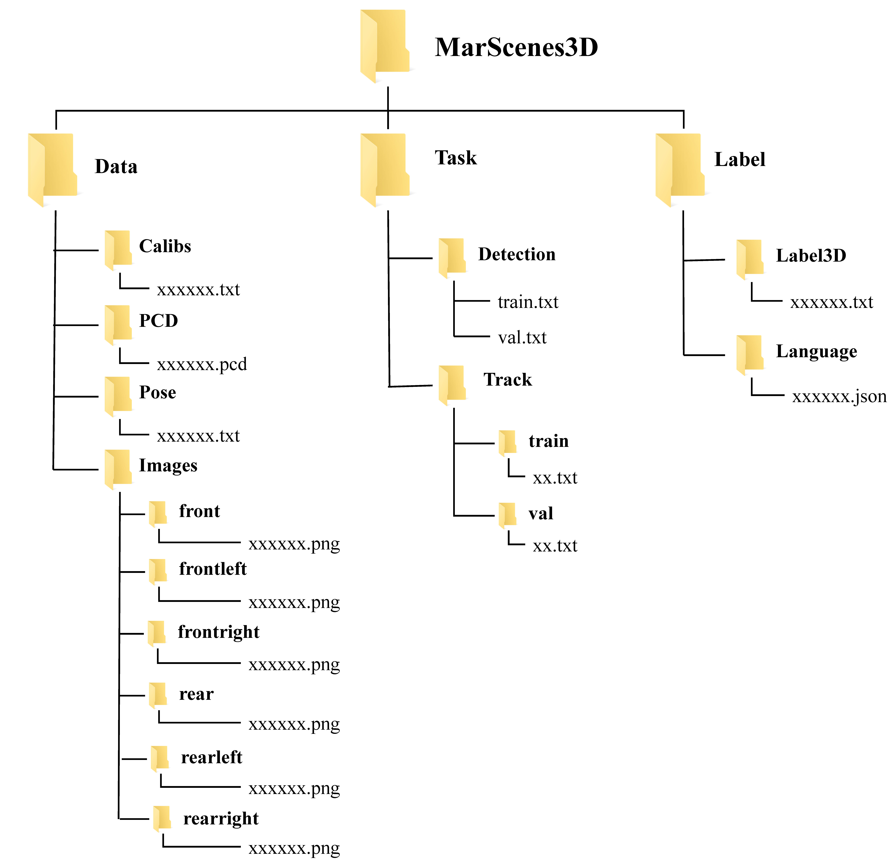
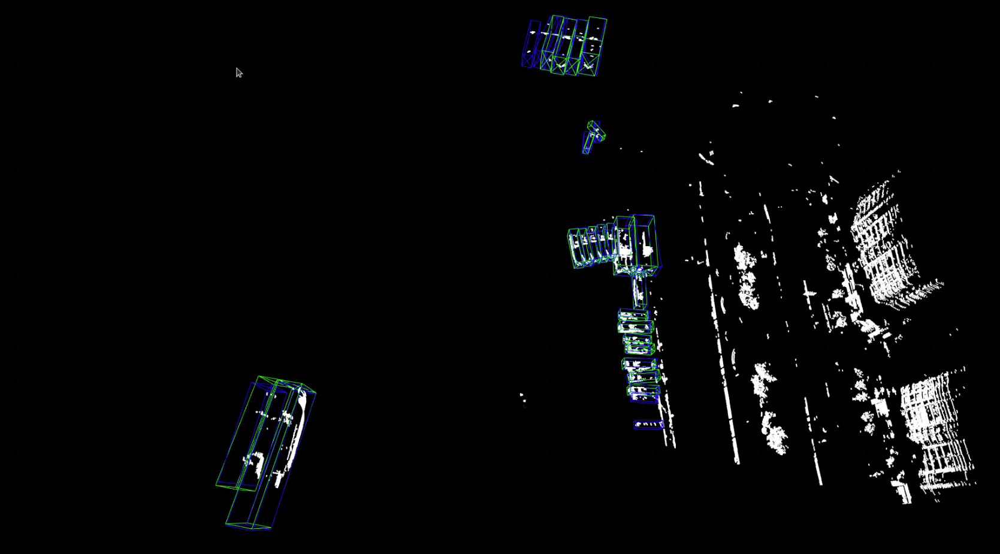
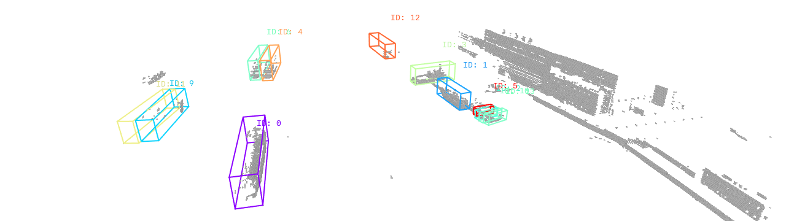

# MarScenes3D
This repository hosts the official release of the MarScenes3D dataset, including data usage instructions and related code.

## dataset overview


This repository hosts a multimodal maritime perception dataset collected from real-world navigation scenarios.
It includes synchronized surround-view camera images, LiDAR point clouds, platform poses, and ego-vehicle velocity data, all organized by timestamp.
The dataset provides high-quality 3D bounding box annotations with consistent object identities, supporting 3D detection and multi-object tracking tasks.
In addition, structured natural language annotations are provided to enable multimodal learning and high-level scene understanding.
It covers diverse maritime environments such as ports, coastal waterways, and open routes, capturing realistic challenges including scale variation and sparse point clouds.

## Dataset organization


## Dataset statistics


## Visualization
### 3d detection
```Bash
#conda your env
python tools/det_vis_demo.py --cfg_file model_config.yaml --data_path data_file_or_directory --ckpt your_model.ckpt
```


### 3d track
```Bash
#conda your env
python tools/3D_detection_track_viewer/maritime3d_viewer.py
```
Modify the `root` variable in the `maritime3d_viewer.py` file to your data path, and `label_path` to the path of your tracking results.


## Acknowledgement
Many thanks to these excellent open source projects:

- [OpenPCDet](https://github.com/open-mmlab/OpenPCDet)
- [Voxel-Mamba](https://github.com/gwenzhang/Voxel-Mamba)
- [MCTrack](https://github.com/megvii-research/MCTrack)
- [UG3DMOT](https://github.com/hejiawei2023/UG3DMOT)
- [HybridTrack](https://github.com/leandro-svg/HybridTrack)
- [PC3T](https://github.com/hailanyi/3D-Multi-Object-Tracker)
  
